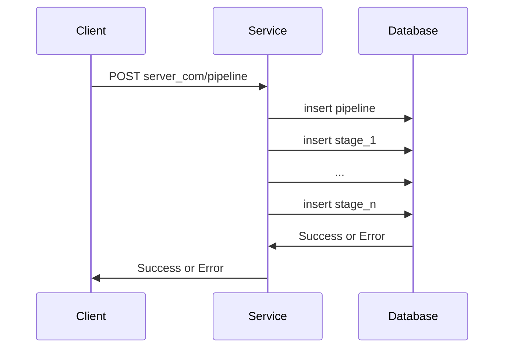
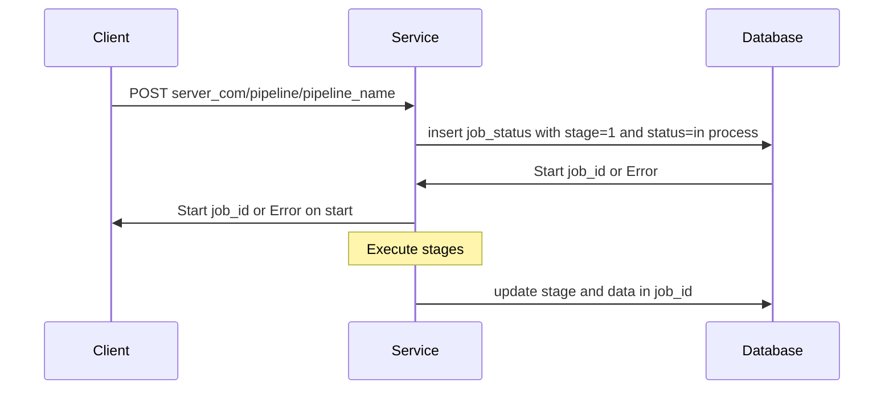
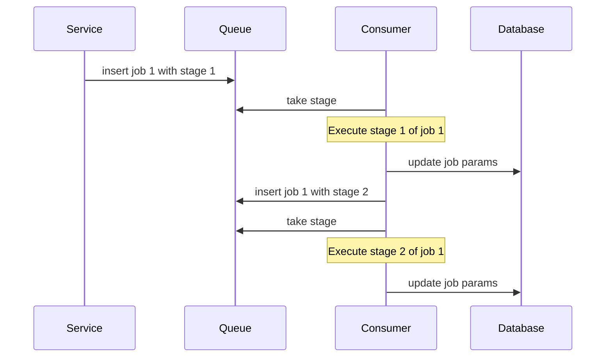
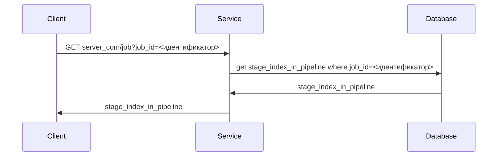
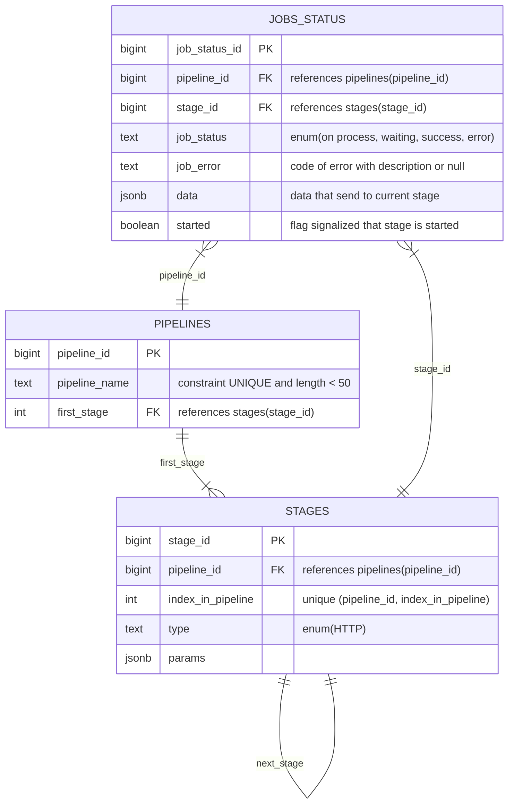

Для создания pipeline отправляется HTTP POST-запрос на server.com/pipeline с данными в формате json следующего вида:
```json
{
    "pipeline_name": <имя pipeline>,
    "stages": <перечисление каждой стадии с их порядковыми номерами с описанием каждой из них в формате json>
}
```

Каждая стадия pipeline также описывается в формате json и имеют следующий вид:
```json
<порядковый номер стадии в конкретном pipeline>:
    {
        "type": <тип сервиса, который вызывается данной стадией, например, http. Возможные варианты типов описаны ниже>,
        "params": <параметры, передающиеся в стадию, в формате json>
    }
```



В качестве параметров стадии могут выступать, например, параметры пути в HTTP запросе, передаваемые данные, возвращаемые значения, возможность передачи выходных параметров в следующую стадию и т.д. Для HTTP запросов параметры представлены следующей таблицей:
| Имя | Обязателен | Описание |
| --- | --- | --- |
| url_path | T | URL-адрес вызываемого сервиса |
| method | T | Метод отправки HTTP-запроса: POST, GET и т.д. |
| path_params | F | jq фильтры для извлечения параметров пути запроса из входящих данных стадии |
| query_params | F | jq фильтры для извлечения параметров запроса из входящих данных стадии |
| body | F | jq фильтры для извлечения данных запроса из входящих данных стадии |
| return_values | F | Хеш-таблица имен возвращаемых значений с jq фильтрами для их трансформации в данные следующей стадии |
| return_codes | F | Массив возможных кодов возврата, при которых выполнение job продолжается |

По итогам создания pipeline сервер возвращает сообщение об успешном создании pipeline или ошибку, возникшую при его создании.

Для запуска pipeline отправляется HTTP POST-запрос на server.com/job?pipeline_name={pipeline_name}, где pipeline_name - имя запускаемого pipeline, с данными, необходимыми для работы сервиса, в формате json. Для HTTP pipeline это могут быть значения параметров пути, query-параметров или просто данными запроса, т.е. json следующего формата:
```json
{
    "path_key1": ".path_filter1",
    "path_key2": ".path_filter2"
    "query_key1": ".query_filter1",
    "query_key2": ".query_filter2"
    "data_key1": ".data_filter1",
    "data_key2": ".data_filter2"
}
```

Сервер возвращает идентификатор начавшейся job или ошибку, возникшую при запуске.



Работа каждой job происходит по паттерну Producer/Consumer: при запуске задачи создается запись в очереди о необходимости запуска конкретной задачи со стадии 1, Consumer забирает очередную задачу, помечает ее в базе данных как начавшуюся, и начинает ее выполнение. При успешном выполнении стадии Consumer записывает в очередь необходимость запуска следующей стадии (при условии, что она не была последней), обновляет соответствующие значения для работы в базе данных (номер текущей стадии, флаг запуска стадии и т.д.). При возникновении ошибки при выполнении стадии Consumer также пишет необходимую информацию в базе данных, но ничего нового в очередь уже не помещает. В обоих случаях после выполнения описанных пунктов освобождается и берет следующую задачу в очереди. Если очередь пуста, то Consumer засыпает (по умолчанию на 5 мс). Количество Consumer может меняться при запуске сервиса, по умолчанию равно 5.

Пример выполнения работы с 2 стадиями:



Чтобы узнать текущую стадию job отправляется HTTP GET-запрос на server.com/job?job_id=<идентификатор>.



Структура базы данных, обслуживающей работу с pipeline представлена ниже:


В качестве примера работы с данным сервисом приведем пример pipeline, позволяющий создать пользователя в базе данных, а затем получнием jwt для дальнейшей авторизации:

Сначала создадим описанный pipeline. Для этого отправляем HTTP POST-запрос на server.com/pipeline с данными:
```json
{
    "pipeline_name": "Authorization",
    "stages": 
        [
            {
                "type": "HTTP",
                "params": 
                    {
                        "url_path": "server.com/users/${path1}",
                        "method": "POST",
                        "body": "{\"login\" : \".login\", \"password\": \".password\"}",
                        "query_params": {"param1": ".query1"},
                        "path_params": {"path1": ".p1"},
                        "return_values": {"user_id": ".user_id"},
                        "return_codes": [200]
                    }
            },
            {
                "type": "HTTP",
                "params": 
                    {
                        "url_path": "server.com/auth",
                        "method": "POST",
                        "data": {"user_id": ".user_id"},
                        "return_values": {"jwt": ".jwt"},
                        "return_codes": [200]
                    }
            }
        ]
}
```

Для запуска данного pipeline необходимо отправить HTTP POST-запрос на server.com/job?pipeline_name=Authorization с данными, например:
```json
{
    "login": "abc",
    "password": "123"
}
```